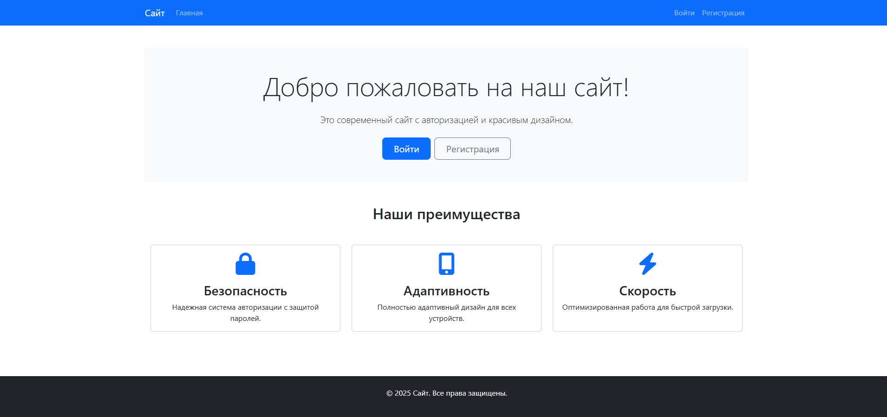

# 🔐 Flask Authentication Boilerplate

Готовый шаблон для быстрого развертывания системы аутентификации на Flask с Bootstrap 5 и SQLite.



## ✨ Особенности

- ✅ Регистрация и вход пользователей  
- ✅ Хеширование паролей (PBKDF2-SHA256)  
- ✅ Сессии с защитой от CSRF  
- ✅ Адаптивный дизайн (Bootstrap 5)  
- ✅ Валидация форм на клиенте и сервере  
- ✅ Готовые шаблоны (Jinja2)  
- ✅ AJAX-уведомления (Flash messages)

## 🛠 Технологии


- Python 3.8+
- Flask
- Flask-SQLAlchemy
- Werkzeug
- Bootstrap 5
- jQuery

## 🚀 Быстрый старт

### 1. Клонирование репозитория

```bash
git clone https://github.com/d1sonder/Flask-Auth-Boilerplate.git
cd Flask-Auth-Boilerplate
```
### 2. Установка зависимостей
```bash
pip install -r requirements.txt
```
### 3. Запуск приложения
```bash
python app.py
```
### 4. Открытие в браузере
```text
http://localhost:5000
```
### 📂 Структура проекта
```text
project/
├── app.py                # Основной скрипт
├── requirements.txt      # Зависимости
├── env/                  # Виртуальное окружение Python
├── instance/             # Файлы экземпляра приложения
│ ├── database.db         # Файл базы данных SQLite
├── static/               # Статические файлы
│   ├── css/              # Стили
│   └── js/               # Скрипты
└── templates/            # Шаблоны
    ├── auth/             # Страницы аутентификации
    └── layouts/          # Базовые шаблоны
```
---
<div align="center"> 2025 | d1sonder </div>
